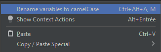
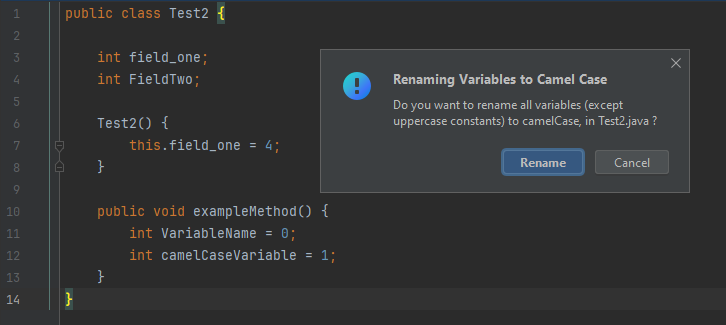
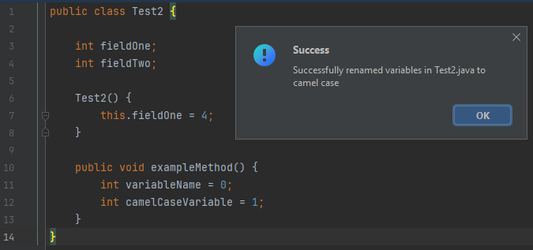
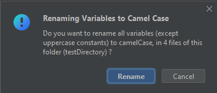
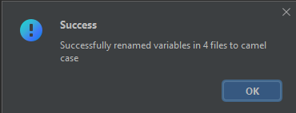

# IntelliJ Idea Camel Case plugin

This plugin allows to replace variables with a different formatting to camel case formatting

> variable_name -> variableName 
> 
> VariableName -> variableName

I made this to discover how IntelliJ Idea plugins work

## Features 
You can trigger the action by 
- right clicking in the editor 
- right clicking on a file / folder 
- from the tools menu at the top the window
- by using a keyboard shortcut (Ctrl+Alt+A then M)

  

The plugin can be called on a file (default behavior), or on a whole folder (by right clicking on it) and will then rename variables in all files from the folder.

### Variables references
The plugin renames the occurencies of this.variable, as it will also rename the field declaration, so it stays consistent, but it does not rename the occurencies of super.variable, as it might break things if the plugin is only called on one file. 

## UI 
The plugin interacts with the user by showing dialog boxes / message boxes

### On a single file:

### On a folder: 

